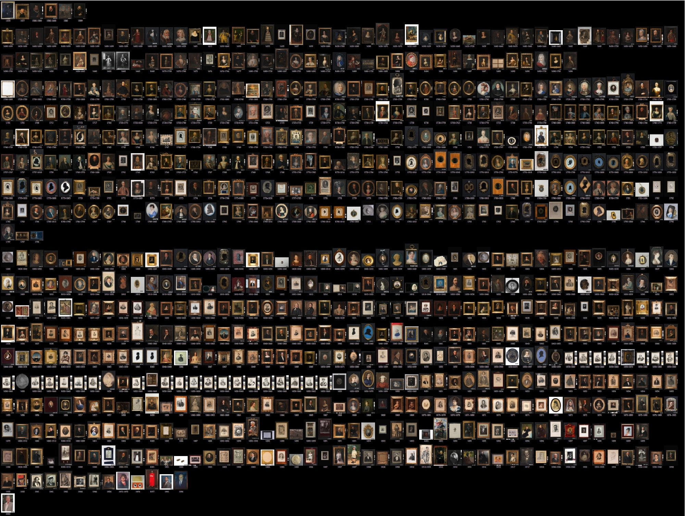
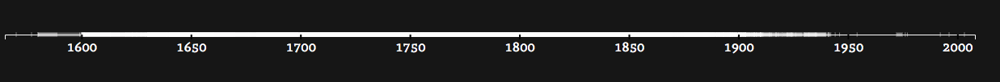
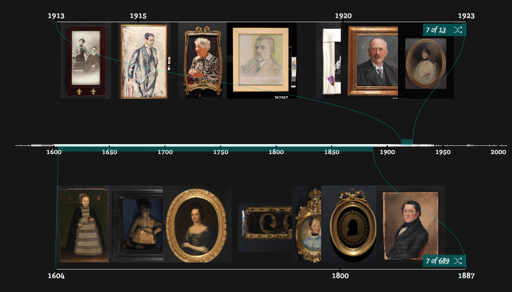
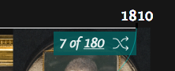
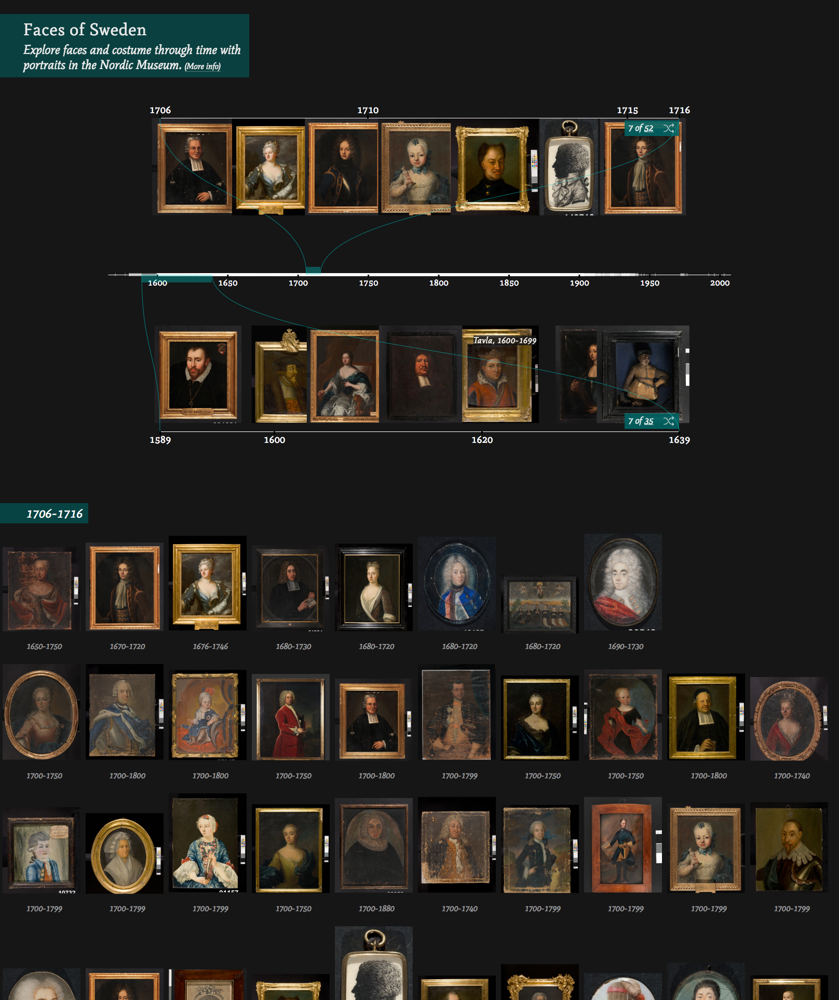
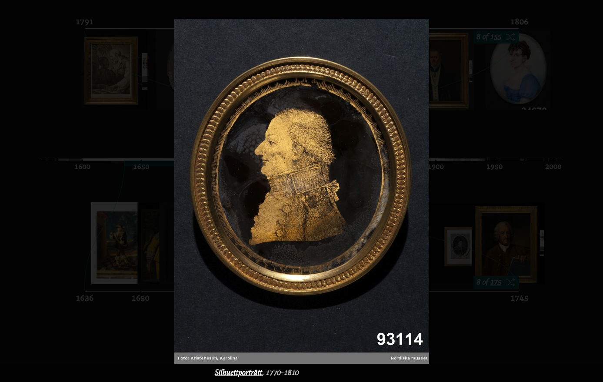
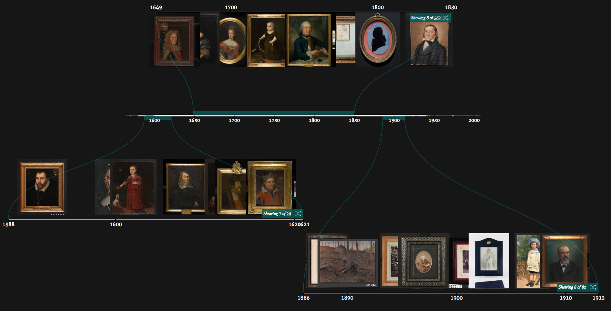
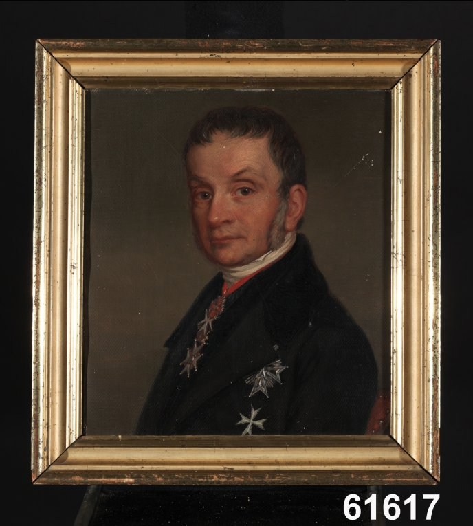

# Faces of Sweden

‘Faces of Sweden’ is a prototype interface showcasing historical portraits. The interactive timeline design offers an easy, visual way to explore portraits from the Nordic Museum, highlighting changing historical costume. 

The interface is built in JavaScript and the visualisation library [d3.js](https://d3js.org/) (version 5.7.0).

## Setup

To view start up a local webserver on `Faces_of_Sweden`. The interactive timeline renders in `index.html`. 

This interface runs off a static dataset: `NM_data.json`. The (commented-out) javascript code used to generate this dataset is contained  in `js/script_timeline.js`. 

## Portraits data 

The interface visualises [Nordic Museum](https://www.nordiskamuseet.se/en) data, sourced from [K-samsök API](http://www.ksamsok.se/in-english/api/) with the search query ‘porträtt and tavla’. 'Faces of Sweden' showcases 785 [portraits](https://digitaltmuseum.se/search/?q=portr%C3%A4tt+tavla&aq=owner%3F%3A%22S-NM%22) (mostly oil paintings, but also prints, silhouettes, photographs) dating between 1570 - 2003.

*Portraits in the Nordic Museum collection, ordered by date and chunked vertically into centuries*

## Design

A main (central) timeline shows the distribution of the data over time. Many items have a wide date span (some items are dated to the century). So, to indicate where portraits can be found, white rectangles are drawn over the timeline for each item’s date span, with greater transparency for larger time spans. The overall visual effect shows when in time there **aren’t** any items, managing the user’s expectation as they browse.

*Main timeline, showing when in time there are/are not items by the strength and thickness of the line*

There are 2 secondary timelines which map to sections of the main timeline (shown by connecting lines). These each display a sample of up to 7 (number can be customised) images from the selected time spans. A user can drag and resize the coloured bars overlaying the main timeline to select different time spans. 

By selecting small timespans, a user can focus on and compare different times:

*Secondary timelines showcasing items from around 1610, and around 1800*

Or by selecting a wide time span, they can cut across time to observe changes:

*Bottom secondary timeline showing portraits from 1604 - 1887*

An annotation on the secondary timelines indicates the proportion of items displayed for the time span. Clicking the shuffle icon shows a different random sample of 7 images. Clicking the total visualises all the images in a tile layout below, organised from earliest to latest.

*Annotation on secondary timeline. Clicking the total, ‘180’, generates a tile view below of all 180 portraits for this time span. Clicking the shuffle icon will display a different 7 images*

*Tile view below timeline*

Clicking on any image, opens a lightbox viewer (powered with [PhotoSwipe](http://photoswipe.com/))  with a link through to the full record on [DigitaltMuseum](https://digitaltmuseum.se/).

*Lightbox viewer*

### Mapping images

On the secondary timelines, up to 7 portraits from the selected time span are displayed. These 7 are a random sample. To even out the distribution of images across time, the sampling works by splitting the selected time span into 7 smaller spans and sampling a unique image for each of these. (If 7 images are sampled over the full time span, the distribution skews to when there are most portraits in the data.)

If an image has a precise date, it is positioned at that date (positioned by the centre of the image). If not, it is mapped at a position halfway along the smaller timespan it was retrieved for. This way, there is a more even spread of images (less overlap, more images visible).

### Number of timelines

The code for the interface has been written so the number of secondary timelines is customisable. 'Faces of Sweden' has 2, but additional ones could be added for displaying on a larger screen. 

*Additional secondary timelines*

### Images

Since images from the Nordic Museum collection often have a number at the bottom right, the bottom 8% height is clipped off all the images. This can be reversed by commenting out `#image_svg, .tile_div img { -webkit-clip-path: inset(0 0 8% 0); clip-path: inset(0 0 8% 0); }` in `stylesheet.css`.

The font used is [Mate](https://fonts.google.com/specimen/Mate) (open license).

*Design/development: [Olivia Vane](https://www.oliviavane.co.uk/) for [National Swedish Heritage Board](https://www.raa.se/in-english/)*